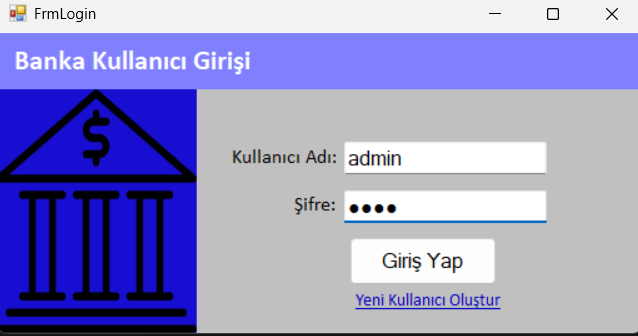
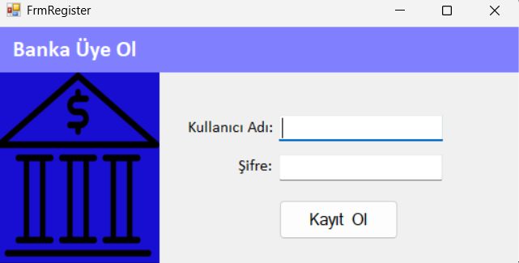
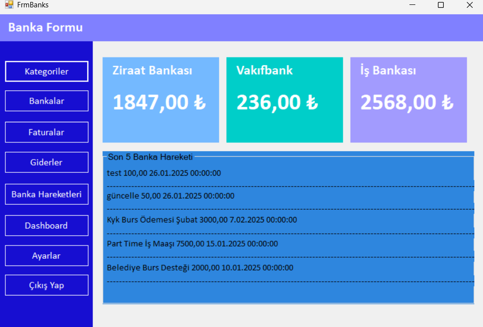
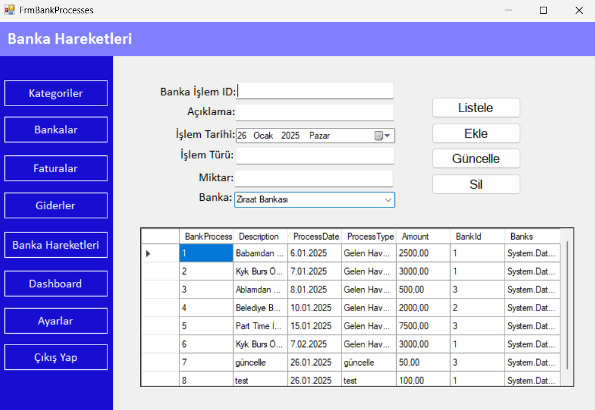
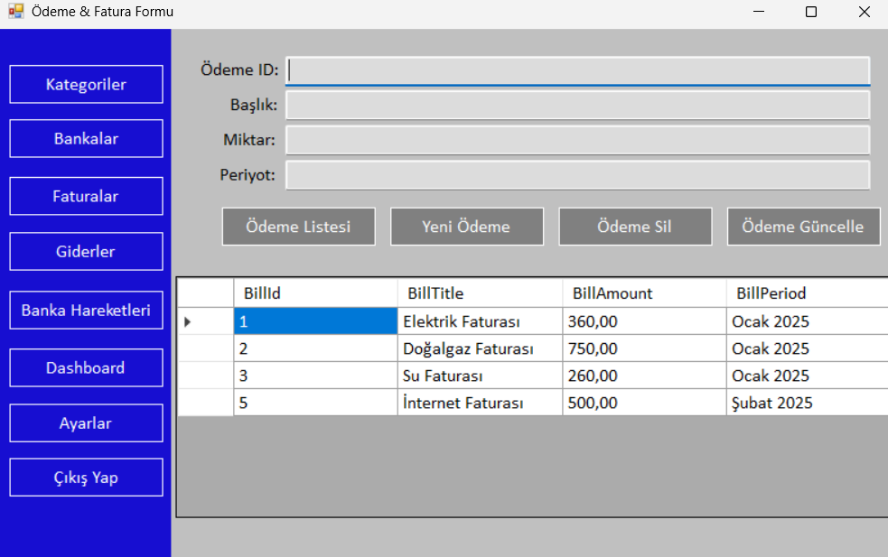
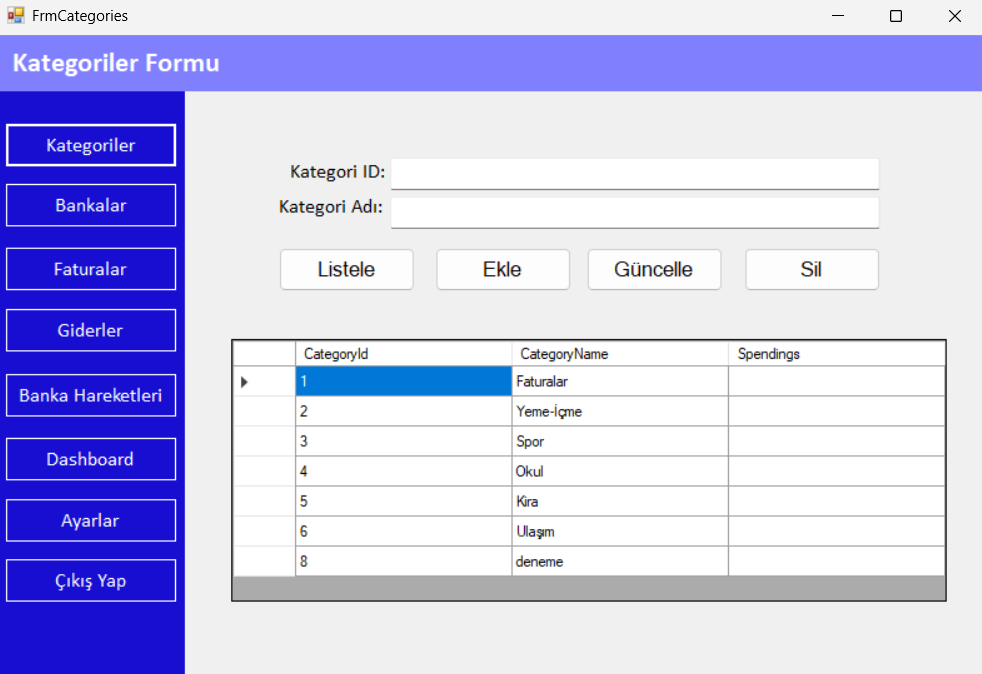
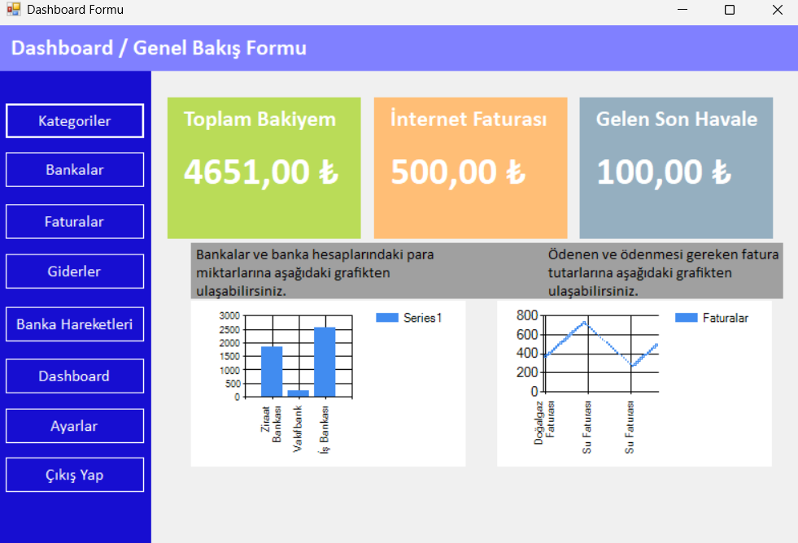
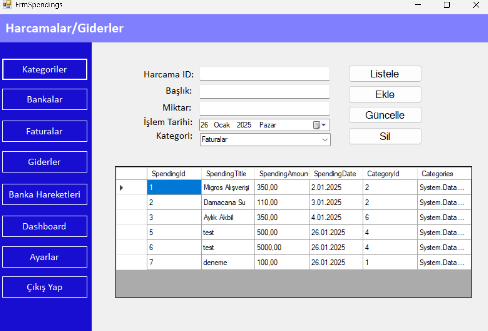

# 🏦 Finansal CRM Projesi

**Finansal CRM Projesi**, finansal hizmetler sektöründe müşteri ilişkilerini yönetmek amacıyla geliştirilmiş bir uygulamadır. Bu proje, kullanıcıların banka hesaplarını, faturalarını ve harcamalarını merkezi bir platformda görüntüleyip yönetebilmelerini sağlar. Ayrıca, kullanıcılar, finansal verilerini analiz edebilmek için çeşitli raporlama ve görselleştirme araçlarına da sahiptir.

---

## 📌 Proje Özellikleri

### 🔑 Sisteme Giriş ve Kayıt  
Kullanıcılar, uygulamaya **kullanıcı adı** ve **şifre** ile güvenli bir şekilde giriş yapabilirler. Eğer sistemde mevcut bir hesap bulunmuyorsa, kullanıcılar **yeni hesap oluşturabilirler**. Bu özellik, kullanıcıların kişisel bilgilerini güvenli bir ortamda yönetmelerini sağlar.  

### 💸 Bankalar ve Bakiyeler  
Kullanıcılar, **kayıtlı banka hesap bilgilerini** görüntüleyebilir ve her bir banka hesabının son **hesap hareketlerini** inceleyebilirler. Bu özellik, kullanıcıların finansal durumlarını her an güncel bir şekilde takip etmelerini sağlar.  

### 💱 Banka Hareketleri  
Bu bölümde kullanıcılar, banka hesaplarındaki **hesap hareketlerini** detaylı şekilde inceleyebilir. Ayrıca, kullanıcılar hesap hareketlerini belirli filtreler aracılığıyla analiz edebilirler. Örneğin, tarih aralığına veya işlem türüne göre filtreleme yapılabilir.  

### 🧾 Fatura Yönetimi  
Kullanıcılar, geçmişteki ve mevcut **faturalarını** görüntüleyebilir, ödemelerini takip edebilir ve borç durumlarını kontrol edebilirler. Ayrıca, faturaların ödeme tarihleri, miktarları gibi detaylar da kolayca erişilebilir.  

### ☑️ Kategoriler  
Harcamalar, kullanıcıların seçtiği **kategoriler** altında düzenlenebilir. Kullanıcılar, harcama kategorilerini görüntüleyebilir ve her bir kategoriye ait harcamaları analiz edebilirler.  

### 📈 Dashboard  
**Dashboard** bölümü, kullanıcıların finansal durumlarını grafikler ve görselleştirmeler aracılığıyla analiz etmelerine olanak tanır. Kullanıcılar, gelir-gider dengesini, borç ödemelerini ve diğer önemli finansal verilerini bu panel üzerinden izleyebilirler.  

### 🛍️ Harcamalar  
Kullanıcılar, geçmiş ve mevcut **harcamalarını** detaylı bir şekilde görüntüleyebilir ve düzenleyebilirler. Harcamaların kategorilere göre ayrılması, kullanıcıların ne kadarını tasarruf ettiklerini ve hangi alanlarda fazla harcama yaptıklarını görmelerini sağlar.  

---

## 💻 Kullanılan Teknolojiler

- **🖥️ C#**: Projenin geliştirilmesinde kullanılan ana programlama dili.
- **🗄️ Microsoft SQL Server**: Veritabanı yönetimi için kullanılan sistem, verilerin güvenli bir şekilde depolanmasını sağlar.
- **📋 Entity Framework**: Veritabanı işlemleri için kullanılan ORM (Object-Relational Mapping) aracıdır ve verilerin yönetilmesini kolaylaştırır.
